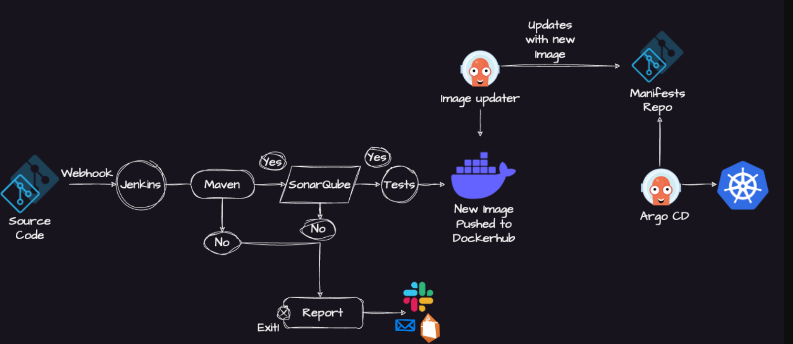
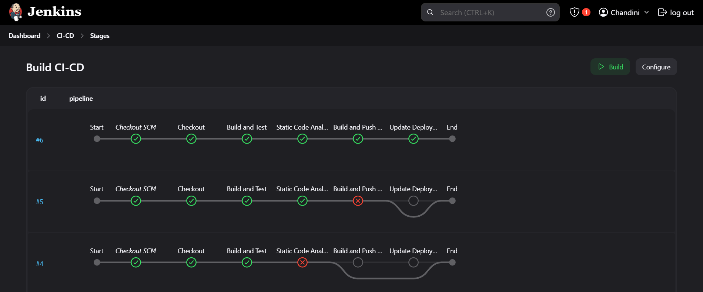
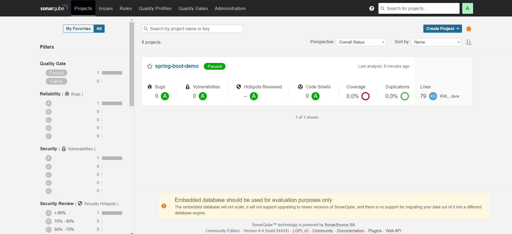
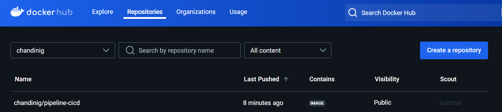
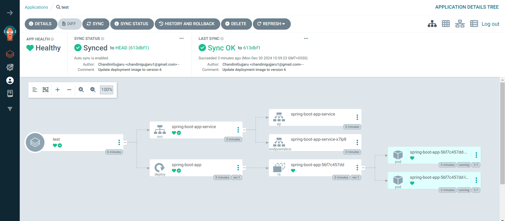

# 🚀 End-to-End CI/CD Pipeline for Spring Boot Application 🚀

I’m excited to share my recent project where I implemented a complete CI/CD pipeline for a Spring Boot application.  
This project demonstrates a complete CI/CD pipeline for a Spring Boot application—from building and testing the app to deploying it in a Kubernetes cluster.

---

## 📊 Project Overview

---

## 🔹 Continuous Integration (CI)

- ✅ Built the application using Maven to generate a JAR file.
- ✅ Ensured code quality with SonarQube for static code analysis.
- ✅ Containerized the application into a Docker image and pushed it to Docker Hub.

📸 **Spring Boot Application**  

### 📸 Jenkins Pipeline

### 📸 SonarQube Report

### 📸 Docker Image

---

## 🔹 Continuous Deployment (CD)

- 🚀 Deployed the Docker image into a Kubernetes cluster.
- ⚙️ Used ArgoCD to manage deployments following GitOps principles.
- 🟢 Achieved high availability with Kubernetes by maintaining two replicas of the application.

### 📸 ArgoCD Deployment
